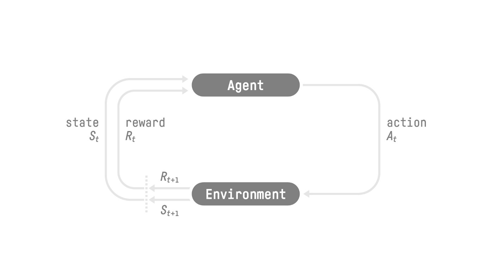

# Reinforcement Learning

Policy, noted π is defined as `π(S) = A`, Given a state the policy tell us what action to do.

## RL Loop

## State and Observation
- **State** S: is a complete description of the state of the world (there is no hidden information). In a fully observed environment.
- **Observation** O: is a partial description of the state. In a partially observed environment.

## Two methods to find the optimal policy π*:
  - **Policy-based methods** : We Directly learn the policy, by teaching the agent to learn which action to take, given the current state.
      - *deterministic policy*: a policy that output one action given a state
      - *stochastic policy*: that output a probability distribution over actions
  - **Value-based methods** : Indirectly, by training a value function that outputs the value of a state or a state-action pair. Given this value function, our policy will take an action.
      - *state-value function* : we calculate the value of a state S
      - *action-value function* :  we calculate the value of the state-action pair (S,A​) hence the value of taking that action at that state.

# Sources
- https://huggingface.co/learn/deep-rl-course